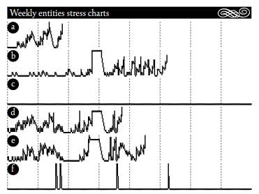
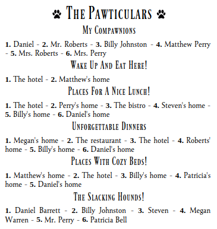
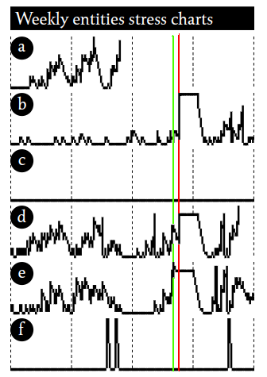
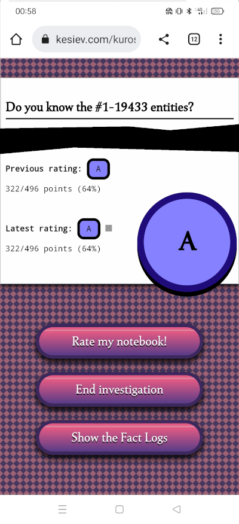

# The #1-19433 Case

**This short story contains mild spoilers of Kuroshimu but...**

...you may find a player experience helpful.

## The Dark Case

My wife was getting ready for her birthday party: the pizza has been ordered but the large table downstairs needed to be prepared.

She still had 15 minutes to spare so she asked me to print a Kuroshimu newspaper. She usually takes 1 hour to clear it with a good score but 
she got good at guessing the _kind of story_ that was generated by turning her gaze across the page. She probably wanted to test her _guessing muscles_.

So the [March 18, 2023 Kuroshimu newspaper](markdown/iteration-1-19433.pdf) came out from the printer. I've not played Kuroshimu as much as my wife but that day's journal was undoubtedly strange. I looked at the stress charts...

<div align="center" style="margin:60px 0">
    <p></p>
    <p>Is that a bug?</p>
</div>

Why A dies so soon? Why A, D, and E charts look synchronized in some way? Why do B, D, and E have a synched peak? Why C and F are so quiet in the meanwhile?

As my friend Preuk suggested to me in a chat, _Kuroshimu is a game heavily based on the metagame_. It's so true that much of the simulation debugging has been possible thanks to my wife's investigations: she was the one who discovered inconsistencies and quirks in the paper, which later turned out to be bugs in the code. And that smelled like a bug. So I joined her investigations.

For those 15 minutes, we went around in circles. We then went down to dinner, with a promise to have a look at it tomorrow.

We resumed the investigation lying on the bed at midnight. It took 1 intense hour to get our final score and to discover that wasn't a bug: it happened a combination we haven't seen before.

## The Community

```
@6 Night Update

Friendship!

At the hotel, entity Mrs. Roberts met a new friend. At the hospital and the hotel, Billy Johnston found a new friend. Entity Daniel Barrett found a new friend at the hotel and the hospital.
```

Once we've identified the entities using our _usual procedure_ and attempted some answers, we discovered that we've underestimated this newspaper part on our second read. These three entities found _a friend_ and _friendship_ is a common theme in the newspaper. These entities were the A, D, and E entities so... maybe their charts were synched _due to being friends and sharing experiences_?

It may be a good guess and it's not so stretched - Kuroshimu is based on following vague leads and seeing if there are more proofs - but is there _more evidence_?

## The Meeting Place

The Pawticulars section has the quality of seeming innocent and particularly useless. Instead, it's where my wife often finds the best leads and I still don't understand how she does it:

<div align="center" style="margin:60px 0">
    <p></p>
    <p>Oh, wow. Leaderboards.</p>
</div>

"Look at here". She points at the _Wake Up And Eat Here!_ leaderboard.

```
Wake Up And Eat Here!

1. The hotel - 2. Matthew's home
```

"Excluding Matthew's home, most of the entities wake up and eat at the hotel. No eating at their homes and the bistro.". Matthew and his wife were _"that boring couple"_ of this simulation iteration and probably they used to have breakfast at their home... but that means that _our three friends probably used to meet at the hotel for breakfast_. Probably every day. That's where our bunch of friends was _synching their stress graph_.

But why their stress graph is so irregular?

## A Toxic Friendship

We didn't manage to understand why and, looking closely at the stress graph, we've seen that something at the B, D, and E peaks was off: they weren't _all truly synchronized_. During our investigations, we learned that the ruler can be a very good friend.

<div align="center" style="margin:60px 0">
    <p></p>
    <p>Aha!</p>
</div>

After 10 attempts the dog sentenced our final score. A.

<div align="center" style="margin:60px 0">
    <p></p>
    <p>So you can get an A with a 64%?</p>
</div>

I really can't spoil you what the **Show the Fact Logs** button does. But there we discovered that _all of our discrimination guesses were sadly wrong_.

Anyway, we did it so we took a step forward toward the end of the game...