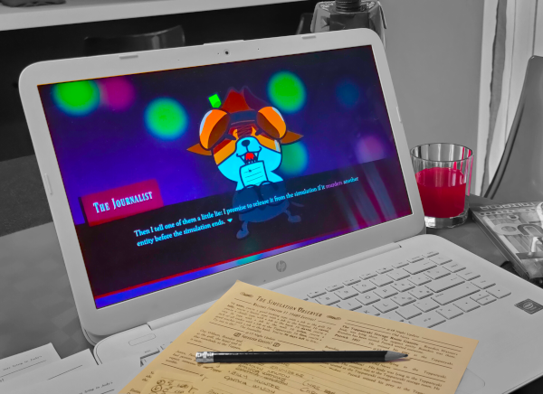
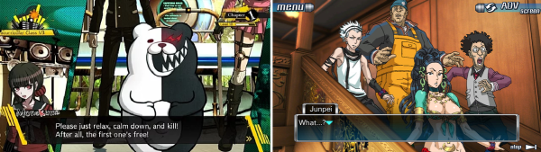
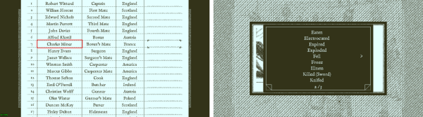
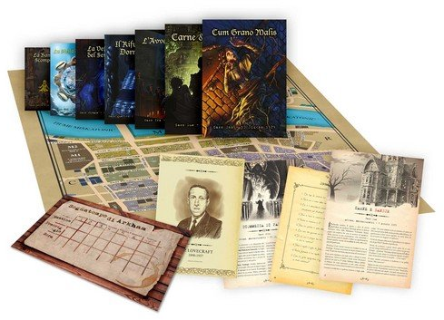
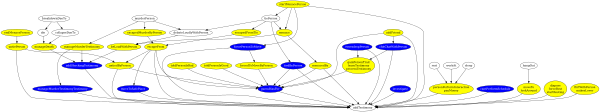
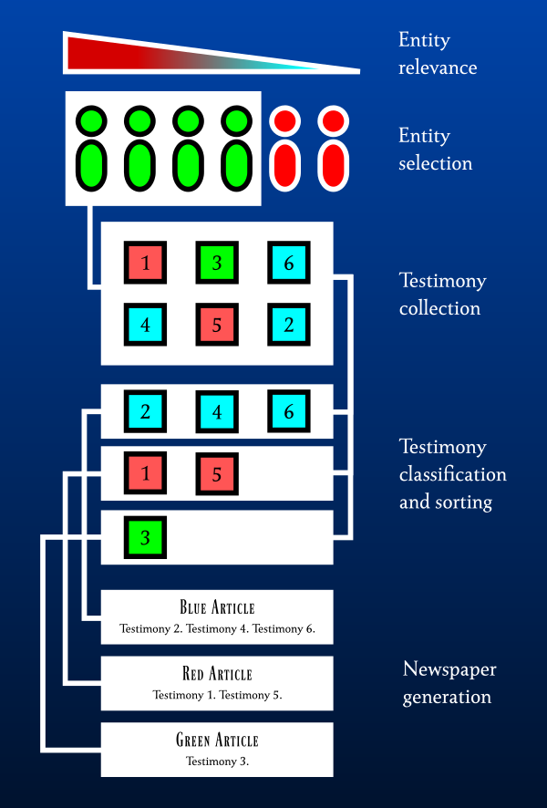
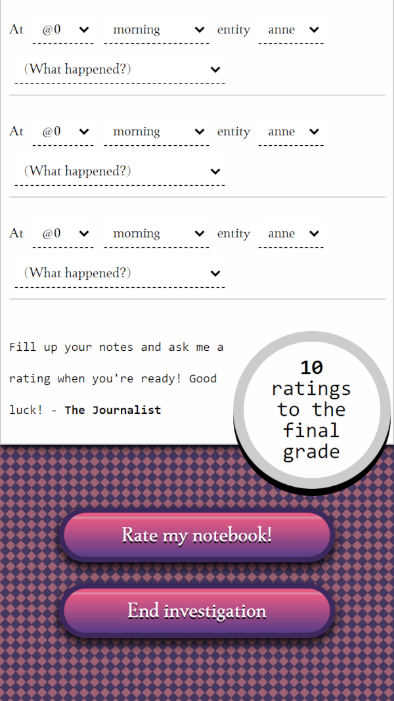
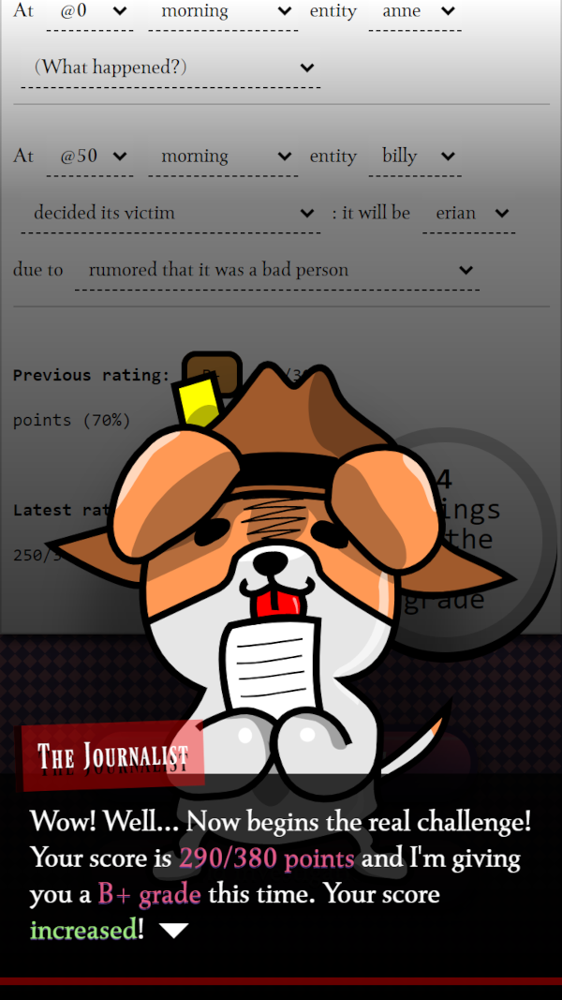

# Kuroshimu

A black box investigation game!

---

<a href="https://www.kesiev.com/kuroshimu">Play</a> | <a href="https://discord.gg/EDYP2N4RMn">Discord</a>

---

## The game

**Kuroshimu** is a procedural black box investigation game: the game simulates 56 days of 6 persons and generates a PDF newspaper from their testimonies for the player to guess what happened. Their life may be just peaceful, so when it starts, the game asks one to murder anyone to spice things up. Its plot is how it works!

    

    
My Kuroshimu setup: copies of The Simulation Observer, pencils, and orange juice.

A **black box investigation game** challenges the player on deducing how an unknown system works by learning how to read its traces and developing an investigation process on its behavior. 
The player will eventually be able to deduce missing important information and predict events.

It's a genre inspired by [reverse engineering](https://en.wikipedia.org/wiki/Reverse_engineering), a process or method through which one attempts to understand through deductive reasoning how a previously made device, process, system, or piece of software accomplishes a task with very little (if any) insight into exactly how it does so. 

### The project

One day I asked my wife how a story about a murderer that tries to hide their doings from the reader with the help of other characters should work.

It happened a few days after watching the now-canceled Netflix TV series [1899](https://en.wikipedia.org/wiki/1899_(TV_series)), a great thriller about the passengers of an immigrant ship headed for New York in 1899, from the same authors of the mind-bending time travel TV series [Dark](https://en.wikipedia.org/wiki/Dark_(TV_series)).

Maybe because of that [The Matrix](https://en.wikipedia.org/wiki/The_Matrix) (1999) movie I saw at the cinema when I was young, I have a weak spot for pseudoscience thrillers about enclosed communities. There have been many other films that have dealt with the same theme, like the great [Shutter Island](https://en.wikipedia.org/wiki/Shutter_Island_(film)) (2010) to [Inception](https://en.wikipedia.org/wiki/Inception) (2010) but, in my opinion, there are two Japanese video game series that have managed to add a new and tantalizing ingredient to the formula: the escape room puzzle game series [Zero Escape](https://en.wikipedia.org/wiki/Zero_Escape) (2009-2017) and the action investigation game series [Danganronpa](https://en.wikipedia.org/wiki/Danganronpa) (2010-2017).

    

    
"Danganronpa: Trigger Happy Havoc" (Left) and "Nine Hours, Nine Persons, Nine Doors" (Right) both by Spike Chunsoft

In both game series, a cast of colorful characters has to unmask the mastermind that's keeping them trapped in a deadly game. As games, they are _interactive_ by definition: the player takes actions to progress the story. But these games also manage to _suggest interactivity to the story_: the player shares the same context and pseudoscience knowledge as the characters and they can make assumptions and draw conclusions just like them. It's a challenge to the viewer who _is one of the characters_ and the story is often _very aware of that_.

This cool concept has not only managed to cross the borders of Japan but also those of its media.

I've already mentioned the German TV series Dark and 1899: the viewer must be extra attentive to detail, discuss, and even write down things to understand the story _before the characters_. In the famous Korean TV series [Squid Game](https://en.wikipedia.org/wiki/Squid_Game) (2021) and the successful Japanese TV series [Alice in Borderland](https://en.wikipedia.org/wiki/Alice_in_Borderland_(TV_series)) the _whole_ Zero Escape/Danganronpa formula appears to the general public with no compromises: the alleged mastermind who kidnaps people and forces them to play deadly games is definitively there.

Meanwhile, Lucas Pope's [Return of the Obra Dinn](https://en.wikipedia.org/wiki/Return_of_the_Obra_Dinn) (2018) video game further refined the video game formula, promoting the investigative challenge to the player from implicit to a core mechanic: the player's main goal is now to guess what happened on an 1807 merchant ship, filling an in-game logbook. The result is fresh, clever, and original.

    

    
The Return of the Obra Dinn logbook

Oh, back to my question to my wife. I talked about it with her for a few hours, gathering several interesting ideas. I was in the throes of sadness about the cancellation of 1899 and with some stimulating ideas in my head. Hunger and desire: the perfect conditions to start a new exploration!

Let's make an investigation game in which the characters' mischievous actions are hidden from the player by the characters themselves!

### Inspiration

There are two games I've played that made me think and act like an investigator: the video game Return of the Obra Dinn and the board game [Mythos Tales](https://boardgamegeek.com/boardgame/126100/mythos-tales) (2016).

    

    
Mythos Tales box content

Mythos Tales is mainly an improved and Cthulhu-themed version of the 1982 board game [Sherlock Holmes Consulting Detective: The Thames Murders & Other Cases](https://boardgamegeek.com/boardgame/2511/sherlock-holmes-consulting-detective-thames-murder). In both games the player uses a newspaper, an address book, a map, and a case booklet that works similarly to a gamebook, to investigate a case.

When the players _think_ they have enough information about the case they may decide to flip to a booklet page and answer a questionnaire. The more correct answers they give, the better their score will be.

Finally, they can read how one of the characters - often the player's mentor - has conducted the same investigation. This way the players can find out more about the case it just finished and learn how to play better in the next case. That's rarely the optimal solution and this allows the players, if they commit themselves, to beat even their own master.

In its simplicity, this game manages to give a surprising sense of immersion: several times I found myself walking in front of the table with my wife, sipping something, and jotting down suspects and places on a notepad. "We can be better than any character in the game. We just have to guess what happened."

In detective stories, there often is a final picture, which is then broken down into pieces that are scattered and handed over to the viewer. Its job is to identify them, select them, and link them together to get the full picture back. In a sense, reality works the other way around: facts happen with a cause/consequence relationship. Seen from a certain angle and interpreted in certain ways, these facts may make up a familiar picture: a love story, a betrayal, or a murder. Then we call the most engaging of them the final picture.

I am well aware that entertainment, real life, and simulations are inspired by each other but they have very distinct rules... but this bug has stuck in my head.

What would a game based on this fact-first principle look like? How could it be built? Putting it together would it be a game or just a mountain of wasted time?

Welp, let's find out.

### Challenge

The idea is to make a simulation in which 6 characters perform actions and interactions following some rules inspired by real life. In a way, it's a kind of Game Of Life on steroids. I want the final picture (or pictures) to _emerge_ from events instead of being described by the program. I want the player to indagate _the facts_ starting from _interpretations of them_ reported by a newspaper.

The simulation shouldn't be too simple: the environment and character interactions must be varied enough to create multiple scenarios and what happens must be plausible and intuitive. On the other side, it shouldn't be too complex: it should be easy to read for the player (i.e. low randomness) and set in a relatively modern and neutral historical time.

Last but not least, it must be within my reach. ;)

So the idea was this:

    

    
The simulation concept

I had enough material to start working on the prototype... but I had a doubt that was gripping me.

Stories are a well-established way to entertain and a large part of modern roguelike games have embraced the idea of ​​offering the player procedurally selected tools to be able to explore it: locations, weapons, characters, etc.

What happens if the tools are fixed and the story is generated?

I decided not to think too much about it and to solve this in the end, by observing how the player approaches the cases. This is an experiment after all... why not use an experimental approach?

Fast forward, it emerged that the game asks the player to _build their own tools_ to _uncover facts_, drawing from intuition, puzzle solving, and a pinch of data analysis skills.

Most of the challenge lies in figuring out which one is the right one since these skills are not compartmentalized in specific tasks: for example, to guess an entity's identity it can be used intuition, identify and solve a puzzle, or carry out several hypotheses as happens in an investigation depending on the case.

This happens quite often in real life when reverse engineering a system. It happens less often in a game, in which the system is often clear from the very beginning. To avoid misunderstandings with the players, I came up with the **black box investigation game** genre - stealing a term from reverse engineering.

### The Simulation

**There will be some mild spoilers from here.** I suggest you [play at least one case](https://www.kesiev.com/kuroshimu) before going on... but it's up to you.

This is how the game works: the player will read _testimonies_ by the simulated persons (called _entities_) that are collected in a newspaper - in a way similar to Sherlock Holmes Consulting Detective. It's an actual newspaper about what happened inside a simulation iteration and, as a real newspaper, you can download, print, and doodle on it.

    

    
A copy of the The Simulation Observer

Since _testimonies_ are sentences about facts told from the point of view of an entity, the true _facts_ may remain hidden. The player's goal is to _guess_ what _actually_ happened inside the simulation iteration and get better at doing that.

    

    
Part of entities testimony processing logic

Entities' decisions, actions, and testimonies are based on a set of rules that are never directly explained to the player: the vast majority of them are deterministic and based on a stats and skill system, taking inspiration from classic RPGs like [Dungeons & Dragons](https://en.wikipedia.org/wiki/Dungeons_%26_Dragons). While most of the actions are inspired by daily life (working, eating, etc.), classic dramas (discussing, loving, etc.), and investigation stories (murdering, violence, etc.), none of them are planned to happen. They _will happen_ if the conditions are _suitable_.

Even guessing _if something happened_ is part of the game, since there may be iterations in which the entities _may happily live their life_. I've found it fun and gives the game that pinch of _realism_ I wanted. But I needed to add something that _mitigates_ these edge cases, something that _works in the simulation with the purpose of making something happen_. If there is something Danganronpa taught me, is that a peaceful place is a perfect place for a _cute_ and _evil_ mastermind to spice things up. And that's how **The Journalist** was born!

### The Journalist

**More mild spoilers here! Be warned!**

The newspaper is made collecting the most relevant testimonies from the most relevant entities every simulated week. The collected data is then mapped to a common structure following a simple set of rules: grouping them by the most common trait to form the article title, then sorting them by date, and merging them by fact type to form the article body. That's all.

    

    
How DATAMAPS-I works

It's clear that this is _the most boring part_ of the whole simulation. I figured even the _algorithm itself_ would notice. And that's why DATAMAPS-I, this project data mapping algorithm, _decided_ to change its name to something fancier and fitting like "The Journalist" and to take over the entire simulation, turning it into his private playground.

    

    
DATAMAPS-I, aka. The Journalist, is not very happy with their work at the simulation

It's time to turn this mass of numbers and text about virtual people into a game _just for the player to have some fun_. More precisely, into a _deadly game_: in every iteration, The Journalist promises to one entity to free it from the simulation if it _commits a murder in 56 days_ just for your investigating pleasure. You're welcome.
### The Notebook

**More mild spoilers here! Be warned!**

The game also gives the player a powerful tool to carry out the investigation: a _digital notebook_. The player can use it on a mobile phone or (more preferably) on a computer to note down its discoveries.

    

    
The investigator notebook

It's inspired by the Return of the Obra Dinn notebook: there are some sentences to complete mainly selecting options from combo boxes.

It indirectly suggests hints about how the simulation works, like what kind of facts and reasons may happen on it, but it also can give more direct hints: similarly to Sherlock Holmes Consulting Detective, when you feel you know enough, you may ask The Journalist - who clearly knows all the facts - a rating about what you've noted down, both in a form of an absolute score and a letter ranking.

The score will be higher based on how many answers have been given and how many of them are correct.

    

    
The Journalist rating a notebook

The player may ask for a rating with no limits, but It will get a _final rating_ after 10 attempts. Depending on the score it may win the _Fact Logs_, a document that tells all the facts that happened in the simulation iteration, or... it may win even something more.

The more the players investigate, the more they know how the black box works. The more they know about the black box, the better their score will be. That's the core game loop of a **black box investigation game**.

### The Story

Yes. The game can be cleared. Good luck!

## Thank you

Thanks to my wife [Bianca](http://www.linearkey.net/) for providing tons of great ideas and inspiration and for testing this game _over and over_.

### Trivia

  - In a very sci-fi fashion, Bianca helped a lot in finding bugs in the simulation using contradictions reported in the DATAMAPS-I newspaper!